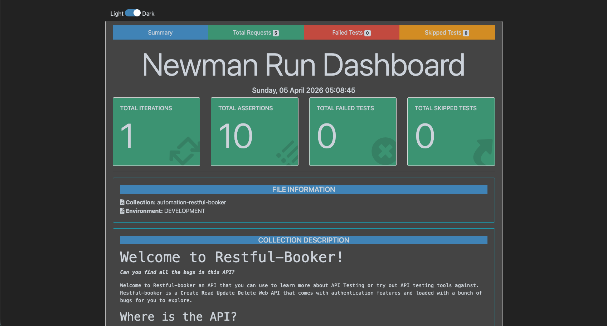
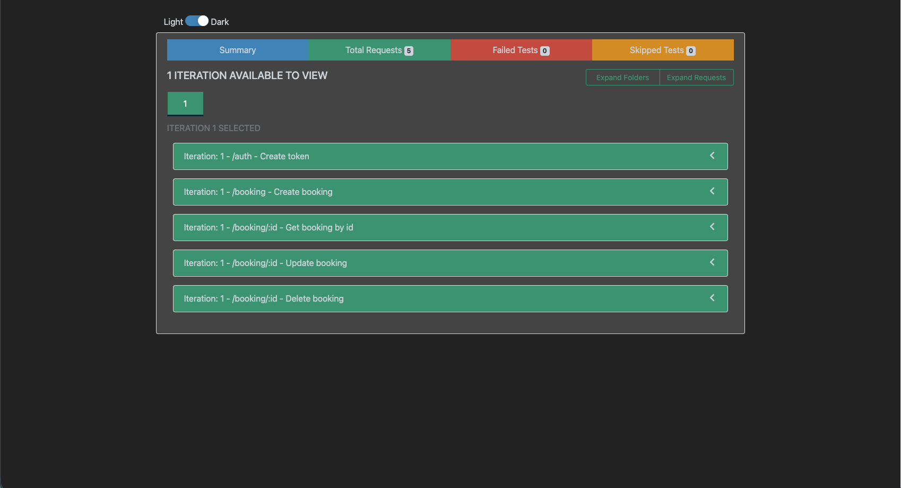
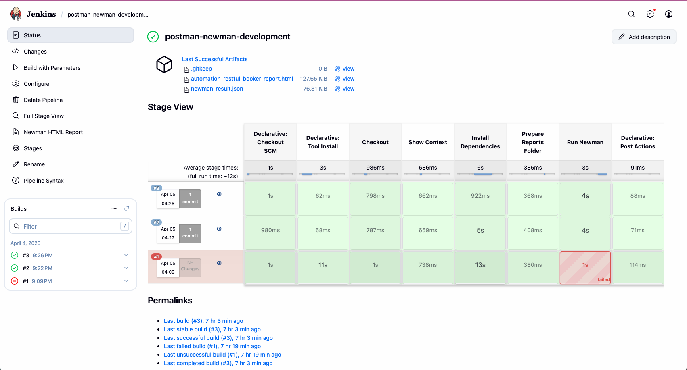
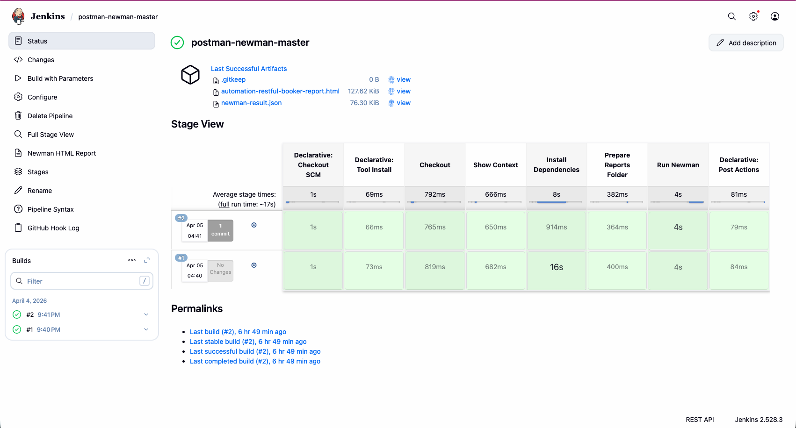

  

# Postman Newman API Automation

API automation portfolio project built with **Postman**, **Newman**, and **Jenkins**.

This repository demonstrates how to create a practical API automation workflow that can be executed locally and integrated into a CI pipeline with environment selection, HTML reporting, JSON reporting, and GitHub webhook-based execution.

---

## Project Overview

This project is part of my QA Automation portfolio.

The main objective of this repository is to automate API testing using Postman collections, execute the tests with Newman, and integrate the execution into Jenkins to simulate a more realistic QA engineering workflow.

This project covers:

- local API test execution with Newman
- manual execution from Jenkins
- GitHub webhook-triggered execution
- environment-based execution
- HTML and JSON report generation
- simple branch-based workflow for development and stable code

---

## Tech Stack

- Postman
- Newman
- newman-reporter-htmlextra
- Jenkins
- GitHub
- Node.js
- npm

---

## Project Structure

```bash
.
├── collections/
│   ├── automation-restful-booker-data-driven.postman_collection.json
│   ├── Automation-Restful-Booker.postman_collection.json
│   ├── complex-nested-json.postman_collection.json
│   └── library-error-handling.postman_collection.json
├── data/
│   └── test-data.csv
├── docs/
├── environments/
│   ├── DEVELOPMENT.postman_environment.json
│   └── STAGING.postman_environment.json
├── reports/
│   └── .gitkeep
├── scripts/
├── .gitignore
├── Jenkinsfile
├── package.json
└── README.md
```

---

## Branch Strategy

This repository uses a simple two-branch workflow:
• development → active development branch
• master → stable branch for verified code

Workflow:
• all active changes are developed in development
• stable changes are merged into master
• Jenkins development job is used for manual testing
• Jenkins master job is triggered automatically via GitHub webhook

---

## Features

• API automation using Postman collections
• Newman CLI execution
• HTML report generation with newman-reporter-htmlextra
• JSON result generation for machine-readable output
• Jenkins pipeline integration
• environment selection using Jenkins build parameters
• GitHub webhook integration for branch-based CI execution

---

## Local Execution

1. Install dependencies

```
npm install
```

2. Run tests with DEVELOPMENT environment

```
npm run test:dev
```

---

## Jenkins Integration

This project is integrated with Jenkins and currently supports two pipeline jobs.

#### Development Job

Used for manual execution and pipeline testing.
• Branch: development
• Trigger: manual
• Parameter: TARGET_ENV

#### Master Job

Used for stable execution from the master branch.
• Branch: master
• Trigger: GitHub webhook
• Optional: scheduled execution

---

## Reporting

The pipeline generates two report outputs:
• HTML report for visual inspection
• JSON report for structured machine-readable output

Output Location

```
reports/automation-restful-booker-report.html
reports/newman-result.json
```




---

## Sample Newman Command

```
newman run collections/Automation-Restful-Booker.postman_collection.json \
-e environments/DEVELOPMENT.postman_environment.json \
-r cli,htmlextra,json \
--reporter-htmlextra-export reports/automation-restful-booker-report.html \
--reporter-json-export reports/newman-result.json
```

## Jenkins Pipeline Highlights

The Jenkins pipeline in this repository includes:
• source code checkout from GitHub
• Node.js runtime setup through Jenkins tools
• dependency installation using npm
• report folder preparation
• Newman execution with selected environment
• artifact archiving
• HTML report publishing




---

## Author

Created by **Herdian Chandra** as part of a QA Automation Engineer portfolio project.
